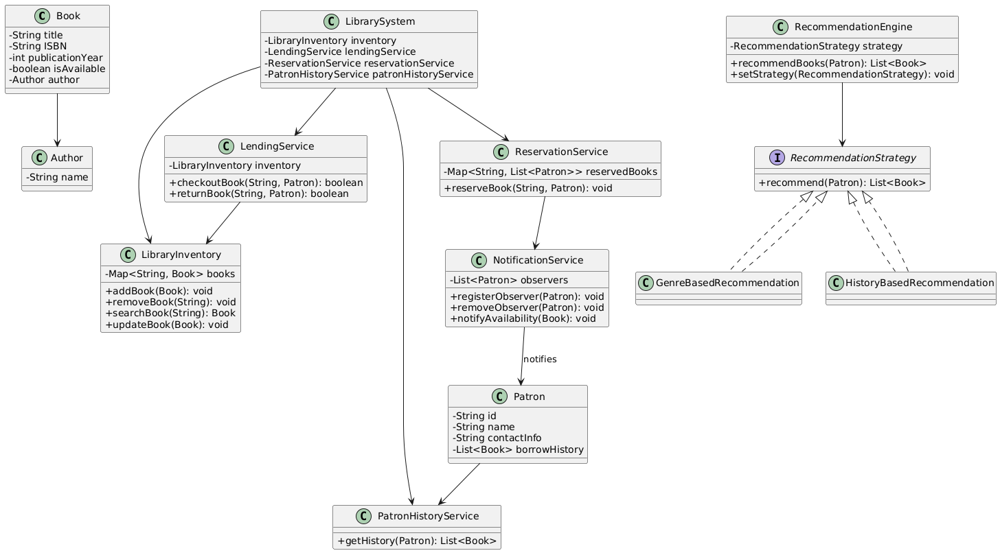

# 📚 [Library Management System (Java)](https://github.com/bansalnishant287/LibraryManagementSystem) 

A console-based Library Management System written in Java to demonstrate key Object-Oriented Programming (OOP) concepts, SOLID principles, and the use of common design patterns like Factory and Observer.

## 🚀 Features

### 🟢 Core Functionalities
- Book management: add, remove, update, and search
- Patron management: register users, update info
- Lending system: checkout and return books
- Inventory tracking: available vs. borrowed

### 🟡 Optional Extensions
- Reservation system: patrons can reserve books
- Notification system: alerts patrons when reserved books become available

---

## 🧠 Design Concepts Applied

| Concept | Usage |
|--------|--------|
| ✅ OOP Principles | Inheritance, encapsulation, abstraction, polymorphism |
| ✅ SOLID Principles | All core packages follow SRP, OCP, and DIP |
| ✅ Design Patterns | **Facade Pattern** (`LibrarySystem.java`), **Observer Pattern** (notification system) |
| ✅ Java Collections | Efficient use of `Map`, `List`, `Queue`, `Set` |
| ✅ Logging | `System.out.println()` used for demo-level logs (can be replaced with logging frameworks)

---

## 🛠️ Technologies Used

- **Java 17+**
- **Java Collections API**
- **SLF4J Logging (via LoggerUtil)**

---

## 📦 Project Package Structure

  📦 library  
  ┣ 📂 books → Book, Author classes and related models  
  ┣ 📂 patrons → Patron, borrowing history service  
  ┣ 📂 inventory → Manages library stock and search functionality  
  ┣ 📂 lending → Lending logic: checkout, return, validations  
  ┣ 📂 reservation → Reservation system for unavailable books  
  ┣ 📂 notifications → Notification service for reservation alerts  
  ┣ 📂 system → Facade LibrarySystem class for orchestration  
  ┣ 📂 utils → Common helper classes (if needed)    
  ┣ 📂 main → CLI or application entry point  

---

## 📐 Class Diagram

> _****

---

## 📌 How to Run

1. Clone the repository:
   ```bash
   git clone https://github.com/bansalnishant287/LibraryManagementSystem.git
   cd LibraryManagementSystem
